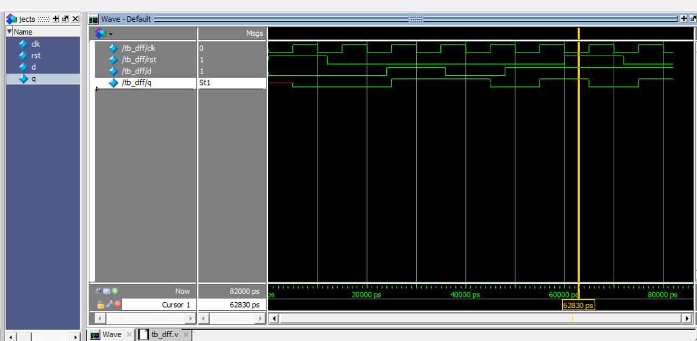

# Verilog Digital Basics

Collection of basic digital design modules implemented in Verilog with simulation testbenches.

---

## Implemented Modules

### 1️⃣ Synchronous D Flip-Flop

A positive-edge triggered D flip-flop with synchronous reset.

#### Features
- Positive edge triggered
- Synchronous reset
- Written in Verilog HDL
- Verified using ModelSim testbench

---

## Folder Structure

rtl/ → RTL design files  
tb/ → Testbench files  
sim/ → Simulation waveform screenshots  

---

## Files

rtl/dff_sync.v → D Flip-Flop design  
tb/tb_dff_sync.v → Testbench for simulation  

---

## Simulation Output

---

## Tools Used

- Verilog HDL  
- ModelSim  
- GitHub  

---

## Author

Aleena Sabu  
ECE Student
